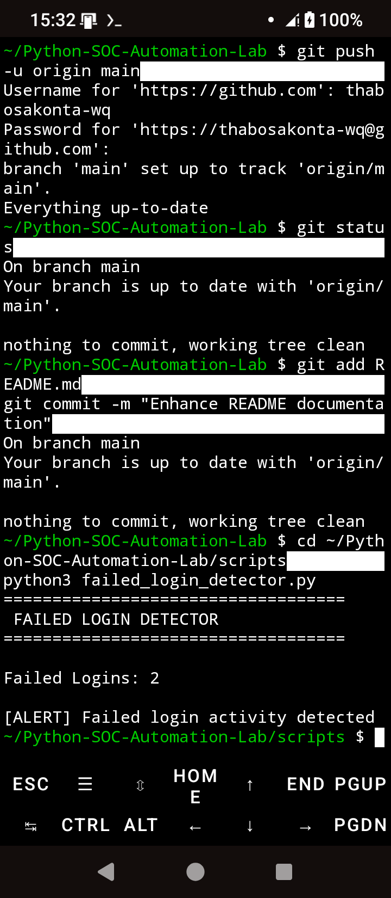
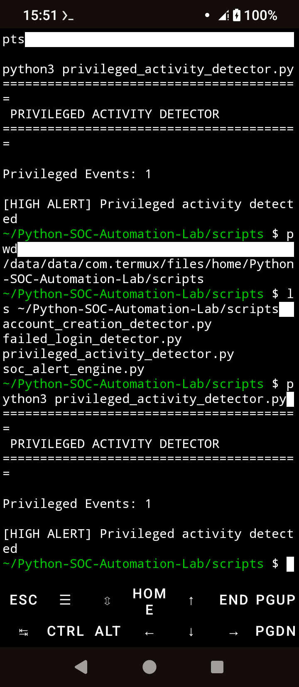
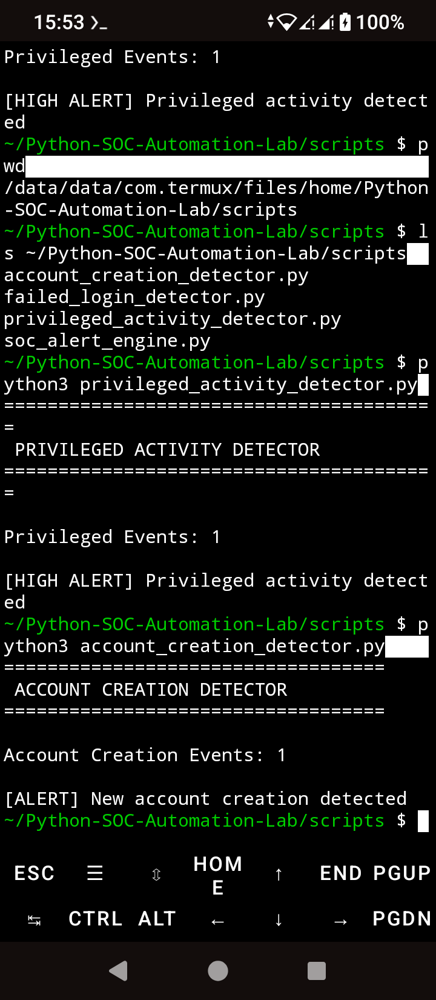
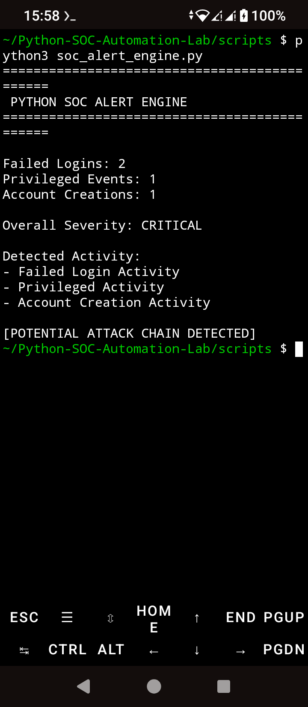

# Python SOC Automation Lab

A cybersecurity project focused on Security Operations Center (SOC) automation, threat detection, event correlation, and MITRE ATT&CK mapping using simulated Windows Security Event Logs.

---

## Overview

This lab demonstrates how SOC analysts detect suspicious authentication activity, privileged account usage, and account creation events. It correlates multiple security signals to identify potential attack chains and generate severity-based alerts.

The project simulates real-world SOC workflows including log analysis, detection engineering, incident correlation, and MITRE ATT&CK mapping.

---

## Features

### Failed Login Detection
Detects repeated failed authentication attempts that may indicate brute-force attacks or credential abuse.

### Privileged Activity Detection
Detects privileged account usage and administrative logons that may indicate privilege escalation or misuse of valid accounts.

### Account Creation Detection
Identifies newly created user accounts that may indicate persistence or unauthorized provisioning.

### SOC Alert Correlation Engine
Correlates multiple security events and generates severity-based alerts to detect potential attack chains.

---

## MITRE ATT&CK Coverage

| Technique | Description |
|-----------|-------------|
| T1110 | Brute Force |
| T1078 | Valid Accounts |
| T1136 | Create Account |
| TA0001 | Initial Access |
| TA0004 | Privilege Escalation |
| TA0003 | Persistence |

---

## Technologies Used

- Python 3
- Linux / Termux
- Windows Security Event Simulation
- Log Analysis
- Detection Engineering
- MITRE ATT&CK Framework
- Threat Hunting
- Security Monitoring
- Git & GitHub

---

## Learning Outcomes

- Security Event Monitoring
- Log Analysis
- Threat Detection
- Event Correlation
- Detection Engineering
- MITRE ATT&CK Mapping
- SOC Operations
- Incident Investigation

---

## Project Structure

Python-SOC-Automation-Lab/

├── logs/

├── reports/

│   ├── mitre_mapping.md

│   └── python_soc_investigation_report.txt

├── screenshot
├── scripts/

│   ├── failed_login_detector.py

│   ├── privileged_activity_detector.py

│   ├── account_creation_detector.py

│   └── soc_alert_engine.py

└── README.md

---

## Screenshots

### Failed Login Detection


---

### Privileged Activity Detection


---

### Account Creation Detection


---

### SOC Alert Engine (Attack Chain Detection)


---

## Sample Output

```text
=============================================
 PYTHON SOC ALERT ENGINE
=============================================

Failed Logins: 2
Privileged Events: 1
Account Creations: 1

Overall Severity: CRITICAL

[POTENTIAL ATTACK CHAIN DETECTED]

Author

Thabo Sakonta
Microsoft Certified Security Operations Analyst (SC-200)

GitHub: https://github.com/thabosakonta-wq
LinkedIn: https://www.linkedin.com/in/thabo-sakonta-377a3748

License

This project is provided for educational and portfolio purposes.
---

# 🔧 NOW APPLY IT

Run:

```bash
nano README.md
